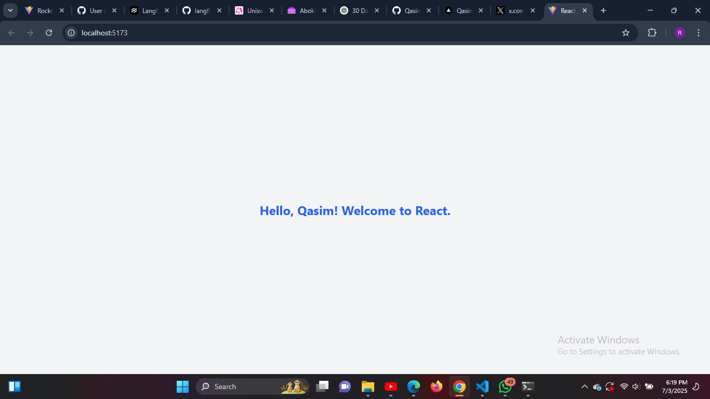

# Day 1 - Hello React 👋

This is Day 1 of my 30-Day React Relearning Journey. The focus of this project is to:

- Set up a modern React project using [Vite](https://vitejs.dev/)
- Integrate Tailwind CSS for styling
- Build and display a simple React component (`Greeting`)
- Pass props and render dynamic content

---

## 🚀 What I Learned

✅ How to scaffold a React project using Vite  
✅ Tailwind CSS configuration for utility-first styling  
✅ Understanding JSX and component structure  
✅ Using props to pass data into components  

---

## 🧠 Tech Stack

- React (JavaScript)
- Vite
- Tailwind CSS

---

## 📸 Preview



---

## 🛠️ Installation & Running Locally

```bash
git clone https://github.com/Qasim-Rokeeb/hello-react.git
cd hello-react
npm install
npm run dev
````

---

## 🌐 Deployment

This project is deployed on [Vercel](https://vercel.com/) — [Live Link](https://hello-react-theta-rouge.vercel.app/)

---

## 🔮 What's Next?

Tomorrow (Day 2), I’ll build a **Counter App** using `useState` to understand React state management.

Stay tuned!

---

## 🙋‍♂️ About Me

* 🔗 Portfolio: [qasimrokeeb.vercel.app](https://qasimrokeeb.vercel.app)
* 🐦 Twitter: [@qasimrokeeb](https://x.com/qasimrokeeb)
* 💻 GitHub: [Qasim-Rokeeb](https://github.com/Qasim-Rokeeb)

---

Made with 💻 by [Qasim Rokeeb](https://github.com/Qasim-Rokeeb)

```
